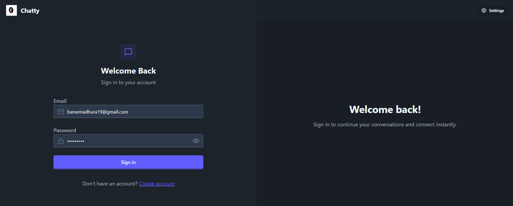
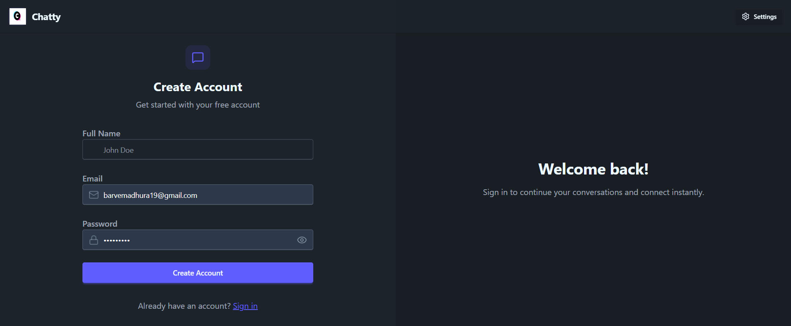
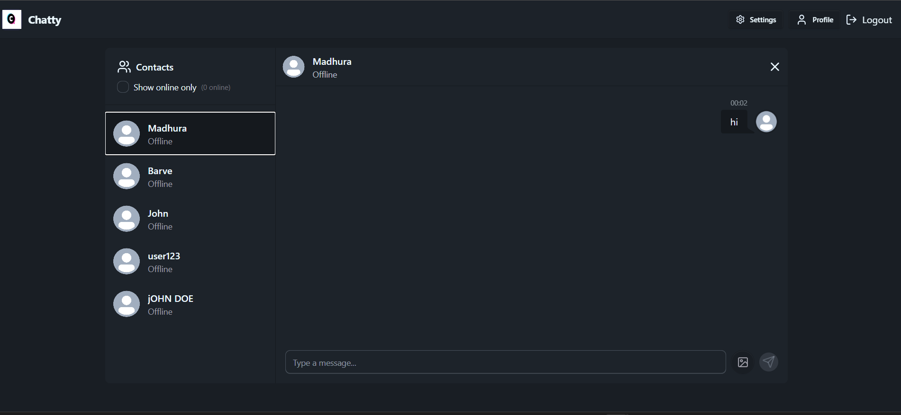
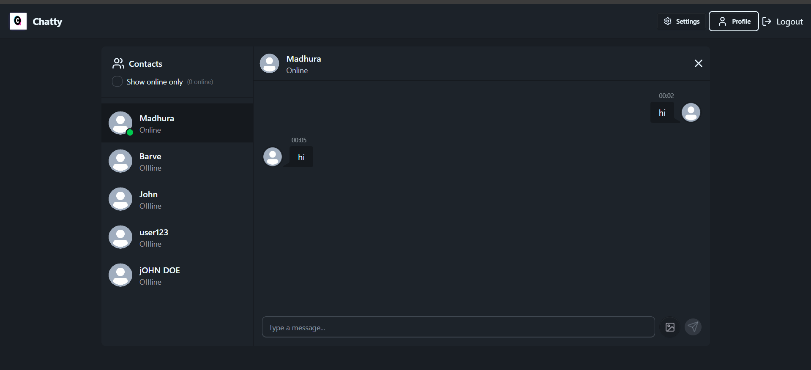
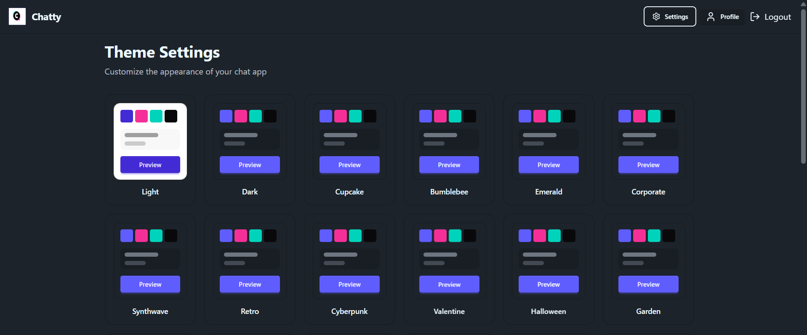
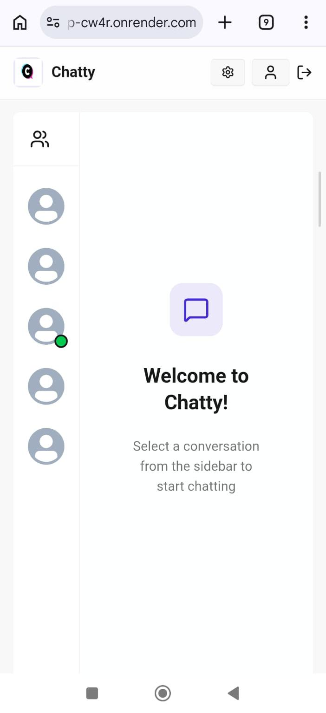

# Chatty — Realtime Chat Application

Chatty is a modern full-stack realtime chat application built with the MERN stack and Socket.IO, designed to provide a seamless and interactive messaging experience.

The platform supports secure authentication, realtime one-to-one messaging, online/offline presence tracking, image sharing with Cloudinary integration, customizable UI themes, and responsive modern design — showcasing scalable full-stack development and realtime communication architecture.

---

# Table of Contents

- Features
- Tech Stack
- Live Demo
- Screenshots
- Project Structure
- Authentication
- Realtime Chat
- Media Sharing
- UI Features
- State Management
- Socket.IO Functionality
- Cloudinary Integration
- Environment Variables
- Installation
- Run Application
- Demo Testing
- Future Improvements
- Author
- License

---

# Live Demo

[Visit Live Application](https://chat-app-cw4r.onrender.com)

---

# Features

✅ Authentication System  
✅ Realtime Messaging  
✅ Online/Offline User Status  
✅ Image Sharing Support  
✅ Multiple UI Themes  
✅ Socket.IO Realtime Communication  
✅ Cloudinary Image Uploads  
✅ Responsive Modern UI  
✅ Secure JWT Authentication  
✅ Zustand State Management  

---

# Screenshots

## Login Page


## Signup Page


## Chat Interface


## Realtime Messaging


## Theme Customization


## Mobile Responsive Design


---

# Tech Stack

## Frontend

- React.js
- Vite
- Tailwind CSS
- DaisyUI
- Zustand
- React Router DOM
- Socket.IO Client
- Axios
- React Hot Toast
- Lucide React Icons

## Backend

- Node.js
- Express.js
- MongoDB
- Mongoose
- Socket.IO
- JWT Authentication
- bcryptjs
- Cloudinary
- Cookie Parser
- CORS

---

# Application Architecture

Chatty follows a full-stack client-server architecture:

```text
        ┌─────────────────────┐
        │      React.js       │
        │     Frontend        │
        └──────────┬──────────┘
                   │
            HTTP / REST API
                   │
                   ▼
        ┌─────────────────────┐
        │    Express.js       │
        │      Backend        │
        └──────┬────────┬─────┘
               │        │
               │        └──────────────┐
               ▼                       ▼
        ┌─────────────┐        ┌──────────────┐
        │   MongoDB   │        │  Cloudinary  │
        │   Database  │        │ Image Storage│
        └─────────────┘        └──────────────┘


        React.js  ◄──── Socket.IO ────► Express.js
                    Realtime
                 Communication
```
---

# Project Structure

```bash
ChatApp/
│
├── backend/
│   ├── src/
│   │   ├── controllers/
│   │   ├── middleware/
│   │   ├── models/
│   │   ├── routes/
│   │   ├── lib/
│   │   ├── seeds/
│   │   └── index.js
│   └── package.json
│
├── frontend/
│   ├── src/
│   │   ├── components/
│   │   ├── pages/
│   │   ├── store/
│   │   ├── lib/
│   │   ├── constants/
│   │   └── App.jsx
│   └── package.json
│
├── images/
│
└── README.md
```

---

# Authentication

- User Signup
- User Login
- JWT Authentication
- Protected Routes
- Logout Functionality
- Cookie-based Authentication

---

# Realtime Chat

- One-to-One Messaging
- Instant Message Delivery
- Online User Tracking
- Realtime Socket Communication
- Auto Scroll to Latest Message

---

# Media Sharing

- Upload Chat Images
- Cloudinary Image Hosting
- Image Preview Support

---

# UI Features

- Modern Dark UI
- Multiple Themes using DaisyUI
- Responsive Design
- Smooth Animations
- Skeleton Loading Screens

---

# State Management

The application uses Zustand for global state management.

## Stores Included

- `useAuthStore`
- `useChatStore`
- `useThemeStore`

---

# Socket.IO Functionality

Implemented realtime features:

- User connection tracking
- Online user list
- Realtime message broadcasting
- Socket cleanup on disconnect

---

# Cloudinary Integration

Cloudinary is used for:

- Profile picture uploads
- Chat image uploads
- Image hosting and optimization

---

# Environment Variables

Create `.env` file in backend directory and add:

```env
MONGODB_URI=your_mongodb_uri
JWT_SECRET=your_secret
CLOUDINARY_CLOUD_NAME=your_cloud_name
CLOUDINARY_API_KEY=your_api_key
CLOUDINARY_API_SECRET=your_api_secret
```

---

# Installation

## Clone Repository

```bash
git clone https://github.com/MADHURA1907/CHAT-APP.git
cd CHAT-APP
```

---

## Install Backend Dependencies

```bash
cd backend
npm install
```

---

## Install Frontend Dependencies

```bash
cd ../frontend
npm install
```

---

# Run Application

## Start Backend

```bash
cd backend
npm run dev
```

Backend runs on:

```bash
http://localhost:5001
```

---

## Start Frontend

```bash
cd frontend
npm run dev
```

Frontend runs on:

```bash
http://localhost:5173
```

---

# Demo Testing

You can create multiple accounts and test:

- Realtime messaging
- Online status
- Theme switching
- Image uploads

Use:
- Chrome normal window
- Chrome incognito window

for realtime chat testing.

---

# Future Improvements

- Group Chats
- Voice Messages
- Video Calling
- Typing Indicators
- Read Receipts
- Push Notifications
- Emoji Picker
- Message Encryption
- File Sharing
- AI Chat Features

---

## Contributing

Contributions are welcome! Feel free to open an issue or submit a pull request with improvements, bug fixes, or new features.
